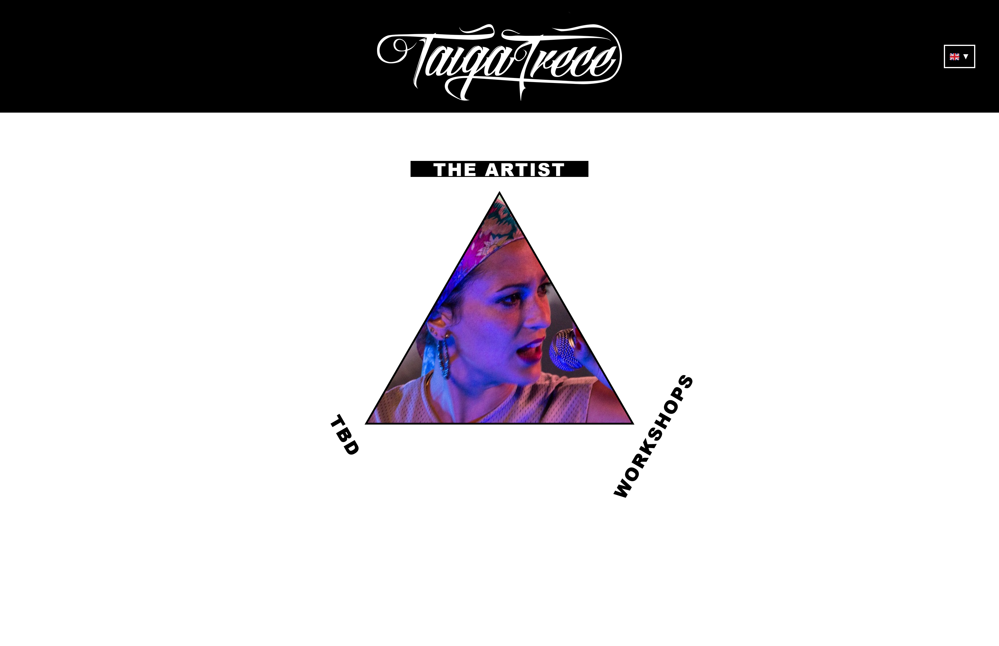

# Taiga - Musician Website

A modern, responsive website for a multi-disciplinary artist showcasing music, workshops, and creative projects. Built with React, TypeScript, and Vite with comprehensive internationalization support.

## Features

- **Geometric Triangle Navigation** - Interactive SVG triangle with mathematical precision and visual feedback
- **Multi-Language Support** - Full internationalization (i18n) with English, German, Spanish, and Japanese
- **Smart Language Switcher** - Responsive dropdown with flag icons and mobile optimization
- **React Router Integration** - Seamless SPA navigation between Music, Workshops, and Home pages
- **Unified Component Architecture** - Consistent LogoHeader and shared components across all pages
- **Mobile-First Responsive** - Optimized touch interfaces and responsive design patterns
- **Professional Content** - Real workshop data, artist information, and comprehensive content structure
- **Lightning Fast** - Built with Vite for instant hot reloading and optimal performance
- **TypeScript** - Type-safe development for maintainable code
- **Modern Design** - Clean aesthetic with focus on content and user experience

## Live Demo

> [Live Site](https://tba.de) | [Portfolio](https://supacoda.de)

## Screenshots

### Triangle Navigation (Homepage)
<div align="center">
  
  <p><em>Interactive SVG triangle with perfect geometric positioning and visual feedback</em></p>
</div>


## Built With

- **[React 19](https://react.dev/)** - UI library with latest features
- **[TypeScript](https://www.typescriptlang.org/)** - Type safety and better developer experience
- **[Vite](https://vitejs.dev/)** - Next-generation build tool and dev server
- **[React Router](https://reactrouter.com/)** - Client-side routing for SPA navigation
- **[React i18next](https://react.i18next.com/)** - Internationalization framework
- **[i18next](https://www.i18next.com/)** - Internationalization library with browser language detection
- **[CSS3](https://developer.mozilla.org/en-US/docs/Web/CSS)** - Modern styling with CSS variables and responsive design
- **[SVG](https://developer.mozilla.org/en-US/docs/Web/SVG)** - Mathematical graphics and interactive elements

## Project Structure

```
taiga_website/
├── public/                      # Static assets
│   └── index.html              # Entry HTML file
├── src/                        # Source code
│   ├── assets/                 # Bundled assets
│   ├── components/             # Reusable React components
│   │   ├── LanguageSwitcher.tsx  # Multi-language selection
│   │   └── LogoHeader.tsx      # Unified header component
│   ├── pages/                  # Route-based page components
│   │   ├── HomePage.tsx        # Triangle navigation page
│   │   ├── MusicPage.tsx       # Artist/music content
│   │   └── WorkshopsPage.tsx   # Workshop listings and info
│   ├── i18n/                   # Internationalization
│   │   ├── index.ts           # i18n configuration
│   │   └── locales/           # Translation files
│   │       ├── en.json        # English translations
│   │       ├── de.json        # German translations
│   │       ├── es.json        # Spanish translations
│   │       └── ja.json        # Japanese translations
│   ├── App.tsx                 # Main application with routing
│   └── main.tsx                # Entry point
├── package.json
└── README.md
```

## Installation & Setup

### Prerequisites
- Node.js (v18 or higher, only needed for development, not hosting)
- npm or yarn

### Quick Start

1. **Clone the repository**
   ```bash
   git clone https://github.com/tmthyDXTR/taiga_website.git
   cd taiga_website
   ```

2. **Install dependencies**
   ```bash
   npm install
   ```

3. **Start development server**
   ```bash
   npm run dev
   ```

4. **Open your browser**
   ```
   http://localhost:5173
   ```
   *Note: If port 5173 is in use, Vite will automatically try the next available port*

### Available Scripts

- `npm run dev` - Start development server with hot reloading
- `npm run build` - Build for production
- `npm run preview` - Preview production build locally
- `npm run lint` - Run ESLint for code quality

## Architecture & Navigation

### Triangle Navigation System
The homepage features a mathematically precise **equilateral triangle** built with SVG:
- **Mathematical positioning**: Perfect center-based geometry using trigonometry
- **Interactive feedback**: Visual hover effects and active states
- **Touch-friendly**: Optimized for mobile interactions
- **Route integration**: Direct navigation to Music, Workshops, and future sections

### Multi-Language Support
Comprehensive internationalization with **react-i18next**:
- **4 Languages**: English, German, Spanish, Japanese
- **Smart Detection**: Automatic browser language detection
- **Responsive Switcher**: Dropdown interface with flag icons
- **Complete Translation**: All content including navigation, pages, and workshop details
- **Persistent Preferences**: Language selection remembered across sessions

### Component Architecture
- **LogoHeader**: Unified header with logo and language switcher
- **LanguageSwitcher**: Responsive dropdown with flag icons and mobile optimization
- **Page Components**: HomePage (triangle), MusicPage (artist focus), WorkshopsPage (comprehensive listings)
- **CSS Variables**: Consistent theming and responsive breakpoints

## Pages & Content

### HomePage (Triangle Navigation)
- **Interactive SVG Triangle**: Mathematical precision with center coordinates (250, 200)
- **Visual Feedback**: Hover effects and active states for each section
- **Responsive Design**: Touch-optimized for mobile devices
- **Multilingual Instructions**: Swipe guidance and navigation hints

### MusicPage (The Artist)
- **Clean Foundation**: Recently restructured for optimal content presentation
- **Artist Focus**: Professional layout ready for music content
- **Unified Header**: Consistent branding with language switcher
- **Translation Ready**: Full i18n integration for international audiences

### WorkshopsPage (Comprehensive Offerings)
Complete workshop and coaching information:
- **6 Workshop Types**: Rap & Songwriting, Female Empowerment, German with Rap, Self-Awareness, Female Health, Rap-Yoga
- **Professional Background**: Detailed artist bio and experience
- **Partnership Information**: Work with Goethe-Institut, Amnesty International, PWC, and more
- **Contact Integration**: Direct inquiry and booking capabilities
- **Multilingual Content**: Full translations for international workshop offerings

## Recent Updates & Changelog

### Latest Release (October 2025)
- ✅ **Internationalization System**: Complete i18n setup with react-i18next
- ✅ **Multi-Language Support**: English, German, Spanish, Japanese with flag icons
- ✅ **Responsive Language Switcher**: Dropdown interface with mobile optimization
- ✅ **Unified Component Architecture**: LogoHeader component used across all pages
- ✅ **Complete Workshop Translation**: All workshop content translated to 4 languages
- ✅ **MusicPage Restructure**: Clean foundation ready for new content development
- ✅ **Router Integration**: Seamless SPA navigation with React Router
- ✅ **Mathematical Triangle**: Perfect geometric positioning with visual feedback
- ✅ **Professional Content**: Real workshop data and artist information
- ✅ **Mobile-First Design**: Touch-optimized interface with responsive breakpoints

### Technical Improvements
- **TypeScript Integration**: Full type safety across all components
- **ESLint Configuration**: Strict code quality standards
- **Vite Optimization**: Fast development server and optimized builds
- **CSS Variables**: Consistent theming and maintainable styles
- **Component Reusability**: Shared components reduce code duplication

## Design Philosophy

This website embraces **minimalism** and **geometric design** principles:

- **Mathematical Precision** - SVG triangle with exact positioning and trigonometry
- **Purposeful Internationalization** - Accessible content for global audiences
- **Component Architecture** - Reusable, maintainable design system
- **Interactive Elements** - Subtle animations and responsive feedback
- **Content-First** - Design serves the music, workshops, and creative work
- **Accessibility** - Inclusive design with multi-language support

## Development Features

## Development Features

### Code Quality & Architecture
- **ESLint Configuration**: Strict linting rules for code quality
- **TypeScript Integration**: Full type safety across components
- **Modern ES6+ Syntax**: Latest JavaScript features and patterns
- **Component-Based Architecture**: Reusable, maintainable components
- **CSS Variables**: Consistent theming and responsive design
- **Vite Plugin Ecosystem**: ESLint integration and optimized builds

### Internationalization (i18n)
- **react-i18next**: Professional translation management
- **Browser Language Detection**: Automatic language selection
- **Namespace Organization**: Structured translation keys (navigation, music, workshops, common)
- **Language Persistence**: User preferences saved locally
- **Dynamic Content**: Real-time language switching without page reload

### Performance & Optimization
- **Vite Build System**: Lightning-fast development and optimized production builds
- **Code Splitting**: Automatic route-based chunking
- **Modern Bundle Output**: ES modules and legacy fallbacks
- **Development HMR**: Instant hot module replacement
- **Production Optimization**: Minification and tree-shaking

## Deployment

### Build for Production
```bash
npm run build
```

### Deploy Options
- **Netlify** - Drag and drop `dist` folder
- **Vercel** - Connect GitHub repository
- **GitHub Pages** - Use `gh-pages` workflow
- **Custom hosting** - Upload `dist` folder contents

## Contributing

Contributions are welcome! Please feel free to submit a Pull Request.

1. Fork the project
2. Create your feature branch (`git checkout -b feature/AmazingFeature`)
3. Commit your changes (`git commit -m 'Add some AmazingFeature'`)
4. Push to the branch (`git push origin feature/AmazingFeature`)
5. Open a Pull Request

## License

This project is licensed under the MIT License - see the [LICENSE](LICENSE) file for details.

## Author

**Taiga** - *Musician & Workshops*

- Website: [tba.com](https://tba.de)
- Email: info@supacoda.de
- Spotify: [Taiga Trece](https://open.spotify.com/artist/tba)


---

<div align="center">

**[Back to Top](#taiga---musician-website)**

Made with care and attention to detail.

</div>
